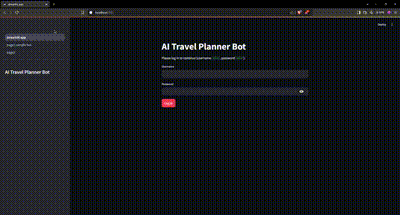

# AI-Vacation-Planner
This is my submission to `Attentions.ai Campus Hiring Assessment`

## Demo:
 \
Watch this on [YouTube](https://youtu.be/xgDJujQPARM)

## Pre-requisites:
1. Ollama \
    can be downloaded from [link](https://ollama.com/)
1. ollama-python \
    `pip install ollama`
1. Stramlit \
    `pip install steamlit`

## Chat with AI Trip Planner:
To start iteractions with the bot: \
Start ollama server: `ollama serve` \
Start Streamlit App: `python -m streamlit run streamlit_app.py`

If App doesn't pop up in browser, go to `http://localhost:8501/`

Test the app using following credentials:\
user: `test`, password: `test`

## Project Details
This project uses Ollma open source Large Language Model. 

The app is designed to interact with the Ollama language model and provide a user interface for generating text based on user input. The app is also designed to remember user preferences across conversations and provide personalized suggestions based on past interactions.

The Ollama can use pre defined tools to provide accurate results. This function calls enables a model to answer a given prompt using tool(s) it knows about, making it possible for models to perform more complex tasks or interact with the outside world.

Example tools include:
1. Functions and APIs
1. Web browsing
1. Code interpreter

The project uses flight time enquiry as example tool used by ollama. This tool enables the model to query for real time flight enquiries.

### References:
1. ollama docs [link](https://github.com/ollama/ollama/blob/main/docs/api.md)
1. streamlit docs [link](https://docs.streamlit.io/)